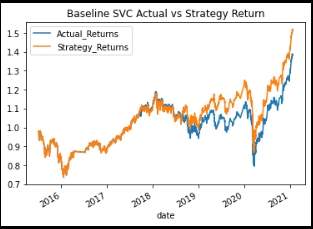
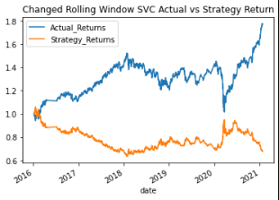
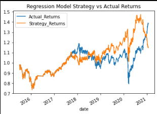

# Module_14_hw - Trading Algo and Machine Learning Model - Evaluating Algo Based on Changes in Parameters 

## Baseline Parameters 
- months_offset = 3 
- short window = 4 
- long window = 100

## Baseline Graph:

- From the graph above we observe that our trading algorithm performed well against the actual returns being able to achieve alpha 

## Strategy Returns With Modified Short Window 

Parameters:
- months_offset = 3
- short window = 20
- long window = 300

- We then changed the short window and long window parameters - From the results (which I believe are incorrect) there is a strong divergence from the start of the trading period. Our performance was significantly lower than the actual returns of our strategy resulting in negative alpha 

## Strategy Returns With Modified Months_offset

Parameters: 
- months_offset = 6 
- short window = 4 
- long window = 100

- When changed the Months_offset parameter we see a lower divergence from the actual retrurns than when we changed our long/short window. However, we are still far off from actual returns and therefore achieving negative alpha. 

## Using Logisitc Regression Model 
- We used the logistic regression from sklearns and complementing it with our trading algorithm in hopes that we would achieve alpha. The results are presented below: 

- From the graph above we see that using a regression model we are able to mimic actual returns over the first 3 years of trading. We then achieved positive alpha, however, by the end of our trading period we failed to beat actual returns although we achieved higher returns from the 2020-2021 period. 

